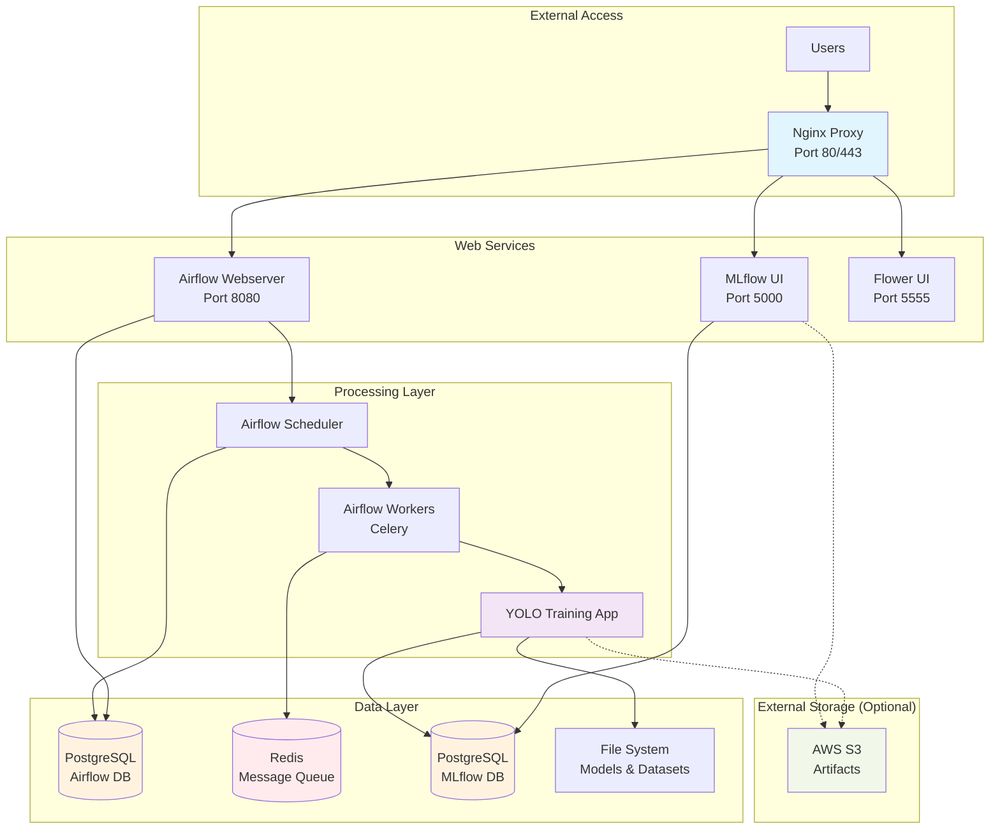

# YOLO Automatic Retraining System

A comprehensive system for automatically retraining YOLO object detection models with MLflow experiment tracking and Apache Airflow orchestration. The system automatically detects new dataset versions, trains models, compares performance, and promotes the best model as the "champion."

## 🚀 Features

- **Automatic Dataset Detection**: Finds the latest dataset version using semantic versioning
- **MLflow Integration**: Complete experiment tracking with metrics, parameters, and model artifacts
- **Champion Model Selection**: Intelligent model comparison with configurable metrics and thresholds
- **Apache Airflow Orchestration**: Monthly scheduled retraining with robust error handling
- **Flexible Configuration**: YAML-based configuration for all aspects of training
- **Comprehensive Reporting**: Detailed reports on training performance and model comparison
- **Easy CLI Interface**: Command-line tools for manual operations and testing

## 📁 Project Structure

```
automatic-retrain/
├── src/                          # Core Python modules
│   ├── dataset_utils.py         # Dataset version management
│   ├── yolo_trainer.py          # YOLO training with MLflow
│   └── model_comparator.py      # Model comparison and champion selection
├── airflow/
│   └── dags/
│       └── yolo_retrain_dag.py  # Airflow DAG for orchestration
├── config/
│   └── training_config.yaml     # Training configuration
├── gold-datasets/               # Dataset storage (to be created)
│   ├── yolo_v1.0.0/
│   ├── yolo_v2.0.0/
│   └── yolo_v3.0.0/
├── models/                      # Model outputs
│   ├── champion/                # Current best model
│   └── train_*/                 # Individual training runs
├── logs/                        # Application logs
├── main.py                      # CLI entry point
├── requirements.txt             # Python dependencies
└── .env.example                 # Environment variables template
```

## 🛠️ Installation

### Option 1: Docker Setup (Recommended)

```bash
git clone <your-repo-url>
cd automatic-retrain

# Quick Docker setup
./docker-setup.sh

# Or manually with make
make docker-setup
```

### Option 2: Native Python Setup

```bash
git clone <your-repo-url>
cd automatic-retrain

# Create virtual environment
python -m venv venv
source venv/bin/activate  # On Windows: venv\Scripts\activate

# Install dependencies
pip install -r requirements.txt
```

### 2. Environment Configuration

```bash
# Copy environment template
cp .env.example .env

# Edit .env with your configurations
nano .env
```

### 3. Create Dataset Structure

The system expects datasets in semantic versioning format:

```bash
# Option 1: Create sample data for testing
python main.py setup-sample-data

# Option 2: Manually create your dataset structure
mkdir -p gold-datasets/yolo_v1.0.0/{train,validation,test}/labels
# Add your YOLO format data and dataset.yaml
```

### 4. MLflow Setup

```bash
# Initialize MLflow (will create mlruns directory)
mlflow ui --host 0.0.0.0 --port 5000
```

### 5. Airflow Setup (Optional)

```bash
# Initialize Airflow database
export AIRFLOW_HOME=./airflow
airflow db init

# Create admin user
airflow users create \
    --username admin \
    --firstname Admin \
    --lastname User \
    --role Admin \
    --email admin@example.com

# Start Airflow webserver and scheduler
airflow webserver --port 8080 &
airflow scheduler &
```

## 📊 Dataset Format

Your datasets should follow this structure:

```
gold-datasets/yolo_v1.0.0/
├── dataset.yaml              # YOLO dataset configuration
├── train/
│   └── labels/              # Training labels (*.txt)
├── validation/
│   └── labels/              # Validation labels (*.txt)
└── test/
    └── labels/              # Test labels (*.txt)
```

Example `dataset.yaml`:
```yaml
train: yolo_v1.0.0/train
val: yolo_v1.0.0/validation
test: yolo_v1.0.0/test
nc: 80
names: ['person', 'bicycle', 'car', ...]  # Class names
```

## 🎯 Usage

### Docker Usage (Recommended)

```bash
# Start development environment
make docker-dev

# Train a model in Docker
make docker-train

# Or run commands directly
docker-compose exec yolo-app python main.py train
docker-compose exec yolo-app python main.py compare

# View logs
make docker-logs

# Stop services
make docker-stop
```

### Command Line Interface (Native)

```bash
# Check available dataset versions
python main.py check-datasets

# Train a model manually
python main.py train --run-name "manual_training_v1"

# Train with specific dataset version
python main.py train --dataset-version "yolo_v2.0.0"

# Compare models and update champion
python main.py compare

# Generate performance report
python main.py report --output model_report.json

# Run complete pipeline
python main.py run-pipeline
```

### Python API

```python
from src.dataset_utils import DatasetVersionManager
from src.yolo_trainer import YOLOTrainer
from src.model_comparator import ModelComparator

# Find latest dataset
manager = DatasetVersionManager()
dataset_info = manager.get_latest_dataset_info()
print(f"Latest dataset: {dataset_info['version']}")

# Train model
trainer = YOLOTrainer()
results = trainer.train_model()

# Compare with champion
comparator = ModelComparator()
comparison = comparator.compare_and_update_champion(results['run_id'])
```

### Airflow Web UI

1. Access Airflow UI at `http://localhost:8080`
2. Enable the `yolo_automatic_retrain` DAG
3. Configure Airflow Variables:
   - `yolo_config_path`: Path to training config
   - `datasets_root`: Root directory for datasets
   - `notification_emails`: Email addresses for notifications

## ⚙️ Configuration

### Training Configuration (`config/training_config.yaml`)

Key sections:

```yaml
# Model settings
model:
  size: "yolov8n"  # Model size (n/s/m/l/x)
  pretrained: true
  input_size: 640

# Training parameters
training:
  epochs: 100
  batch_size: 16
  patience: 50
  lr0: 0.01

# Champion selection criteria
champion_selection:
  metric_weights:
    "mAP@0.5:0.95": 0.4
    "mAP@0.5": 0.3
    "precision": 0.15
    "recall": 0.15
  min_improvement_threshold: 0.01
```

## 📈 MLflow Experiment Tracking

The system automatically logs:

- **Parameters**: Model size, training settings, augmentation parameters
- **Metrics**: mAP@0.5, mAP@0.5:0.95, precision, recall, training time
- **Artifacts**: Best model weights, dataset configuration, training logs
- **Models**: Registered models for easy deployment

Access MLflow UI at `http://localhost:5000` to view experiments.

## 🏆 Champion Model Selection

The system uses a weighted scoring system to select the best model:

1. **Composite Score Calculation**: Weighted average of key metrics
2. **Improvement Threshold**: Minimum improvement required to replace champion
3. **Automatic Promotion**: Best model becomes the new champion
4. **Artifact Management**: Champion model artifacts are automatically copied

## 📅 Automatic Scheduling

The Airflow DAG runs monthly (1st at 2 AM) and:

1. **Checks** for new dataset versions
2. **Trains** YOLO model with latest data
3. **Compares** performance with current champion
4. **Updates** champion if new model is better
5. **Cleans** up old artifacts
6. **Sends** notifications about results

## 🔧 Troubleshooting

### Common Issues

1. **No datasets found**:
   ```bash
   python main.py setup-sample-data
   ```

2. **MLflow connection errors**:
   - Check `MLFLOW_TRACKING_URI` in `.env`
   - Ensure MLflow server is running

3. **CUDA out of memory**:
   - Reduce `batch_size` in config
   - Use smaller model (`yolov8n` instead of `yolov8x`)

4. **Airflow DAG not visible**:
   - Check `AIRFLOW__CORE__DAGS_FOLDER` path
   - Ensure DAG file has no syntax errors

### Logging

Check logs in:
- Console output for immediate feedback
- `logs/` directory for persistent logs
- MLflow UI for experiment logs
- Airflow UI for DAG execution logs

## 🚀 Deployment

### Docker Deployment Options

#### Development Environment
```bash
# Full development setup with Jupyter
make docker-dev
# Access: MLflow (5000), Airflow (8080), Jupyter (8888)
```

#### Production Environment
```bash
# Production setup with PostgreSQL, Redis, Nginx
make docker-prod
# Access: http://localhost (Nginx proxy)
```

#### GPU Support
```bash
# Enable GPU support for training
docker-compose -f docker-compose.yml -f docker-compose.gpu.yml up -d
```

### Production Considerations

1. **Database**: Use PostgreSQL instead of SQLite for production
2. **Message Broker**: Use Redis/RabbitMQ for Celery
3. **Reverse Proxy**: Nginx for load balancing and SSL termination
4. **Storage**: Configure S3/Azure Blob for artifact storage
5. **Monitoring**: Use Flower for Celery monitoring
6. **SSL/TLS**: Configure HTTPS certificates
7. **Backup**: Regular backup of databases and artifacts

### Environment Variables for Production

```bash
# Production passwords (set in .env.docker)
POSTGRES_PASSWORD=secure_password
MLFLOW_DB_PASSWORD=secure_mlflow_password
AIRFLOW_SECRET_KEY=secure_secret_key

# Remote storage
AWS_ACCESS_KEY_ID=your-key
AWS_SECRET_ACCESS_KEY=your-secret

# Email notifications
AIRFLOW__SMTP__SMTP_HOST=smtp.gmail.com
AIRFLOW__SMTP__SMTP_USER=your-email@gmail.com
AIRFLOW__SMTP__SMTP_PASSWORD=your-app-password
```

### Service Architecture

The system uses a microservices architecture with Docker containers, where Nginx routes traffic to web interfaces, Airflow orchestrates ML workflows, and dedicated databases ensure data persistence and scalability.



## 🤝 Contributing

1. Fork the repository
2. Create a feature branch: `git checkout -b feature-name`
3. Commit changes: `git commit -am 'Add feature'`
4. Push to branch: `git push origin feature-name`
5. Submit a Pull Request

##  Roadmap

- [ ] Multi-GPU training support
- [ ] Integration with cloud platforms (AWS SageMaker, Azure ML)
- [ ] Real-time model serving endpoints
- [ ] Advanced hyperparameter optimization
- [ ] Integration with data versioning tools (DVC)
- [ ] Support for other object detection frameworks
- [ ] Web dashboard for monitoring and control# automatic-retrain
